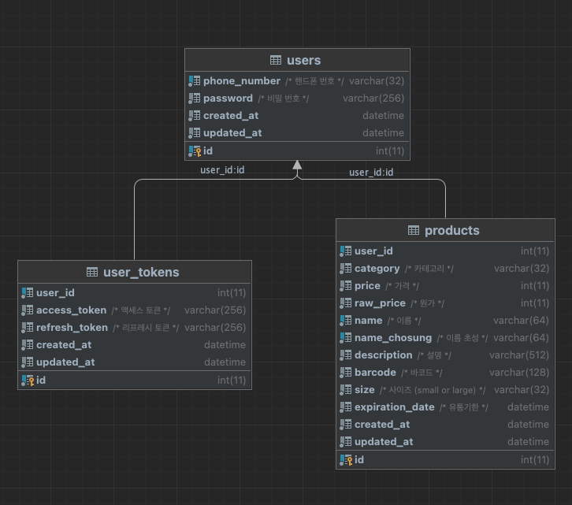

## 1. 기술스택
- Language: Python 3.8.17
- Framework: FastAPI 0.101.0
- DB: mysql 5.7
- DB Migration Tool: Alembic 1.11.2
- ORM: SQLAlchemy 2.0.19

## 2. 로컬 개발 환경 셋팅
### 2.1. 도커로 서버를 띄우는 경우
- 도커 빌드 및 실행
    ```bash
    $ docker compose up -d
    ```
### 2.2. DB만 도커로 띄우고 로컬에서 서버를 띄우는 경우
- 도커 빌드 및 실행
    ```bash
    $ docker compose up db -d
    ```
- 테이블 마이그레이션 실행
    ```bash
    $ alembic upgrade head
    ```
- 로컬 서버 실행
    ```bash
    $  python3 main.py --env local --debug  
    ```
### 2.3. 기타 정보
- 서버 정보 (FastAPI) 
  - http://localhost:8000 
  - host: localhost
  - port: 8000 
- DB 정보 (mysql 5.7)
  - host: localhost
  - port: 3306
  - user: root
  - password: fastapi
  - database: fastapi
- 스웨거 주소
  - http://localhost:8000/docs
- API 관련 script
  - api.http 참고
  - 각 API 호출 가능
- 테스트
  - 단위 테스트 작성 되어 있음
      ```bash
      $  pytest  
      ```

## 3. Architecture
- Layered Architecture 사용
- Layer 구성
  - controller (Presentation Layer)
  - service (Service/Business Logic Layer)
  - Repository (Persistence Layer)
- 도메인 단위로 모듈 분리
  - product - 상품 관련 도메인
  - user - user, auth 관련 도메인

## 4. Directory Structure
```
.
├── main.py 
├── docker # 도커 관련 코드
│   ├── api
│   └── db
├── migrations # 테이블 마이그레이션 관련 폴더 (DDL 포함)
│   └── versions
├── src
│   ├── common # 공통적으로 사용된 라이브러리 / 패키지가 저장된 폴더 
│   ├── main.py
│   ├── {domain} # 특정 도메인(user, product) 폴더 
│   │   ├── controller # Presentation Layer
│   │   │   └── {domain}_controller.py
│   │   ├── interface # 도메인 내에서 사용되는 자료구조
│   │   │   ├── {domain}_dto.py
│   │   │   ├── {domain}_enum.py
│   │   │   ├── {domain}_request.py
│   │   │   └── {domain}_response.py
│   │   ├── model # 모델
│   │   │   └── {domain}_model.py
│   │   ├── repository # Persistence Layer
│   │   │   └── {domain}_repository.py
│   │   └── service # Service Layer
│   │       └── {domain}_service.py
└── tests # 테스트 
```

## 5. Table Specification
- DDL
  - migrations/versions/e5d5a2067ea8_init_migrations.py 참고
- model
  - src/user/model/user_model.py
  - src/product/model/product_model.py
- ERD
  - 

## 6. API Specification
- 스웨거 주소
  - http://localhost:8000/docs
- JWT Token(Authorization Header) No Need 
  - user
    - 회원 가입: POST {base_url}/api/v1/users/sign-up 
    - 로그인: POST {base_url}/api/v1/users/sign-in
- JWT Token(Authorization Header) Need
  - user
    - 로그 아웃: POST {base_url}/api/v1/users/sign-out
  - product
    - 상품 등록: POST {base_url}/api/v1/products
    - 상품 목록 조회: GET {base_url}/api/v1/products
    - 상품 상세 조회: GET {base_url}/api/v1/products/{product_id}
    - 상품 업데이트: PATCH {base_url}/api/v1/products
    - 상품 삭제: DELETE {base_url}/api/v1/products